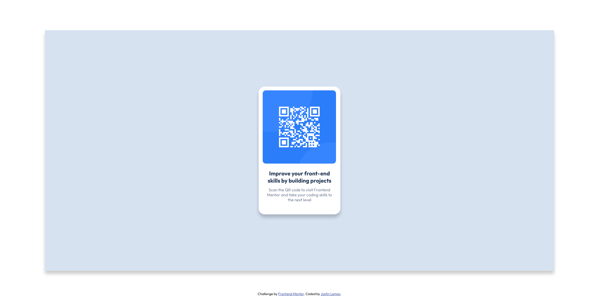

# Frontend Mentor - QR code component solution

This is a solution to the [QR code component challenge on Frontend Mentor](https://www.frontendmentor.io/challenges/qr-code-component-iux_sIO_H). Frontend Mentor challenges help you improve your coding skills by building realistic projects.

## Table of contents

- [Overview](#overview)
  - [Screenshot](#screenshot)
  - [Links](#links)
- [My process](#my-process)
  - [Built with](#built-with)
- [Author](#author)

## Overview

### Screenshot

### Links

- Solution URL: [Add solution URL here](https://your-solution-url.com)
- Live Site URL: [Add live site URL here](https://your-live-site-url.com)

## My process

Pretty much just copied the design pictures as closely as possible.

### Built with

- HTML
- CSS
- Flexbox

## Author

- Website - [Justin Lemos](https://www.justinlemos.com)
- Frontend Mentor - [@Kagyu24](https://www.frontendmentor.io/profile/Kagyu24)
- Twitter - [@Kagyu24](https://twitter.com/Kagyu24)
# FrontendMentor-QR-Code
# FrontendMentor-QR-Code
